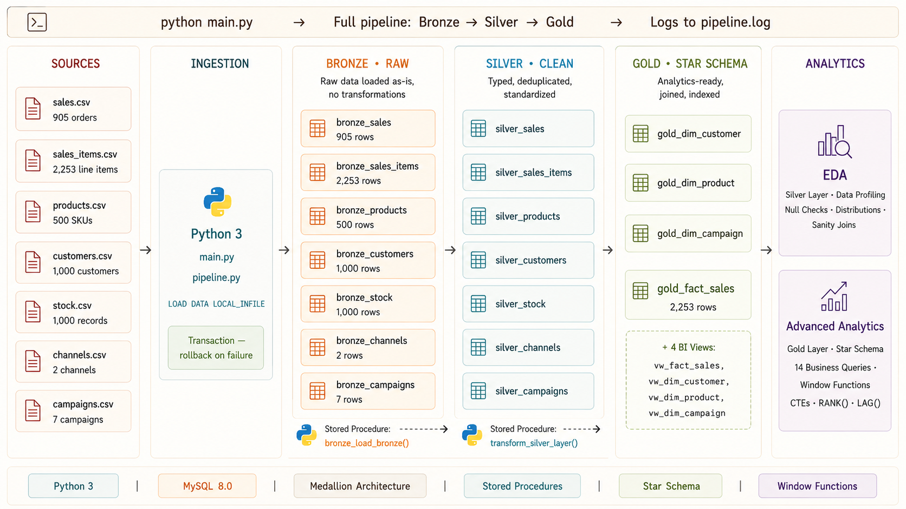

# 🛍️ European Fashion Retail Data Warehouse

**MySQL · Python · Medallion Architecture · SQL Analytics**

[](https://www.python.org/)
[](https://www.mysql.com/)
[]()
[]()

---

## 🏗️ Architecture



---

## 📋 Table of Contents

- [Project Overview](#-project-overview)
- [Tech Stack](#-tech-stack)
- [Data Sources](#-data-sources)
- [Project Structure](#️-project-structure)
- [Bronze — Raw Ingestion](#-bronze-layer--raw-ingestion)
- [Silver — Cleaned & Standardized](#-silver-layer--cleaned--standardized)
- [Gold — Star Schema](#-gold-layer--star-schema)
- [Data Quality Tests](#-data-quality-tests)
- [Pipeline Execution](#️-pipeline-execution)
- [Business Findings](#-business-findings)
- [SQL Analytics](#-sql-analytics)
- [How to Run](#-how-to-run)

---

## 📌 Project Overview

An end-to-end SQL data warehouse built for a European fashion retail business operating across six countries — Germany, France, Italy, Netherlands, Spain, and Portugal. The pipeline ingests raw transactional data from seven source tables, cleans and standardizes it through a Medallion Architecture in MySQL, and produces a star schema ready for business reporting and SQL-based analytics.

The project is built entirely with **MySQL and Python** — no cloud services, no orchestration tools. Python handles the orchestration and automation: one command runs the full pipeline from raw CSV ingestion to a production-ready Gold layer with referential integrity, indexed fact tables, and BI-ready views. The pipeline runs with a single command, logs every step to `pipeline.log`, and rolls back the entire transaction if any layer fails.

The analytical layer covers 14 business questions across revenue performance, product profitability, campaign effectiveness, customer segmentation, channel attribution, and inventory risk — demonstrating end-to-end SQL skills from window functions and CTEs to stored procedures and star schema joins.

**What this pipeline builds:**
- 7 Bronze tables — raw CSV data loaded as-is into MySQL
- 7 Silver tables — cleaned, typed, and standardized via stored procedures
- 4 Gold tables — star schema (3 dimensions + 1 fact table) with foreign keys and indexes
- 4 BI-ready views on top of the Gold layer
- 14 analytical SQL queries across sales, products, customers, campaigns, and inventory

---

## 🔧 Tech Stack

| Layer | Tool | Purpose |
|---|---|---|
| Ingestion & Orchestration | Python 3.12 | Run pipeline end-to-end, load CSVs, execute SQL scripts, handle transactions |
| Storage | MySQL 8.0 | Local data warehouse — all three medallion layers |
| Transformation | SQL Stored Procedures | Bronze reset, Silver cleaning, Gold star schema build |
| Analytics | Advanced SQL | Window functions, CTEs, RANK(), LAG(), business KPI queries |
| Data Quality | SQL Test Queries | Row count checks, null checks, referential integrity validation |

---

## 📂 Data Sources

All data is sourced from a European fashion retail store dataset representing real transactional, product, customer, and inventory records.

| File | Description | Rows |
|---|---|---|
| `dataset_fashion_store_sales.csv` | Order-level sales records | 905 |
| `dataset_fashion_store_salesitems.csv` | Line-item detail per sale | 2,253 |
| `dataset_fashion_store_products.csv` | Product catalog with prices and costs | 500 |
| `dataset_fashion_store_customers.csv` | Customer demographics and signup dates | 1,000 |
| `dataset_fashion_store_stock.csv` | Inventory levels by product and country | 1,000 |
| `dataset_fashion_store_channels.csv` | Sales channel reference | 2 |
| `dataset_fashion_store_campaigns.csv` | Marketing campaign definitions | 7 |

---

## 🗂️ Project Structure

```
DataWarehouse-EuropeanEcommerce/
│
├── sql/                                # All SQL scripts
│   ├── initialize_datawarehouse.sql    # Creates the MySQL database and schemas
│   ├── bronze/
│   │   ├── ddl_bronze.sql              # Bronze table definitions
│   │   └── bronze_reset_procedure.sql  # Stored procedure — truncates Bronze tables
│   ├── silver/
│   │   ├── ddl_silver.sql              # Silver table definitions
│   │   └── transform_silver.sql        # Stored procedure — cleans and transforms data
│   ├── gold/
│   │   └── ddl_gold.sql                # Star schema + views — dimensions and fact table
│   └── analytics/
│       ├── eda.sql                     # Exploratory data analysis — Silver layer
│       └── advanced_analytics.sql      # 14 business analytics queries — Gold layer
│
├── Tests/
│   └── data_quality_tests.sql          # Data quality validation queries
│
├── data/
│   ├── raw/                            # Original unmodified source files
│   │   ├── dataset_fashion_store_sales.csv
│   │   ├── dataset_fashion_store_salesitems.csv
│   │   ├── dataset_fashion_store_products.csv
│   │   ├── dataset_fashion_store_customers.csv
│   │   ├── dataset_fashion_store_stock.csv
│   │   ├── dataset_fashion_store_channels.csv
│   │   └── dataset_fashion_store_campaigns.csv
│   ├── commerce/                       # Processed files loaded by pipeline
│   │   ├── sales.csv
│   │   ├── sales_items.csv
│   │   ├── products.csv
│   │   └── customers.csv
│   └── operations/                     # Processed operational files
│       ├── stock.csv
│       ├── channels.csv
│       └── campaigns.csv
│
├── src/                                # Python source modules
│   ├── config.py                       # Database connection config (env vars)
│   ├── pipeline.py                     # Core pipeline logic — 4 stages
│   └── db.py                           # MySQL connection helpers
│
├── docs/                               # Architecture diagram
│   └── architecture.png
│
├── main.py                             # Pipeline entry point — run this
├── pipeline.log                        # Auto-generated execution log
└── requirements.txt
```

---

## 🥉 Bronze Layer — Raw Ingestion

Seven tables loaded as-is from source CSV files using MySQL's `LOAD DATA LOCAL INFILE` — the fastest bulk-load method available in MySQL. A stored procedure (`bronze_load_bronze()`) truncates all Bronze tables before each run to ensure idempotency.

| Table | Source | Rows |
|---|---|---|
| `bronze_sales` | sales.csv | 905 |
| `bronze_sales_items` | sales_items.csv | 2,253 |
| `bronze_products` | products.csv | 500 |
| `bronze_customers` | customers.csv | 1,000 |
| `bronze_stock` | stock.csv | 1,000 |
| `bronze_channels` | channels.csv | 2 |
| `bronze_campaigns` | campaigns.csv | 7 |

---

## 🥈 Silver Layer — Cleaned & Standardized

A stored procedure (`transform_silver_layer()`) handles all cleaning. Silver tables are built from Bronze with the following transformations applied:

- All IDs cast from `VARCHAR` to `INT`
- All dates cast from `VARCHAR` to `DATE`
- All monetary values cast to `DECIMAL(10,2)`
- Discount percentages stripped of `%` character and cast to `FLOAT`
- Whitespace trimmed on all string columns
- Duplicate rows removed using `ROW_NUMBER()` window functions
- `NULL` values filtered on primary keys and critical columns

---

## 🥇 Gold Layer — Star Schema

Analytics-ready star schema with surrogate keys, referential integrity, and four BI-ready views built directly on top.

```
gold_fact_sales (2,253 rows — one row per line item)
    ├── gold_dim_customer   (1,000 rows — customer demographics)
    ├── gold_dim_product    (500 rows  — product catalog)
    └── gold_dim_campaign   (7 rows    — marketing campaigns)
```

Campaigns are joined to the fact table on `channel` + date range (`sale_date BETWEEN start_date AND end_date`) — meaning each sale item is automatically attributed to the campaign that was active on that channel at the time of purchase.

**Views created on Gold:**
- `vw_fact_sales` — fully joined fact view (customer + product + campaign context per item)
- `vw_dim_customer`, `vw_dim_product`, `vw_dim_campaign` — clean dimension views

---

## ✅ Data Quality Tests

SQL-based data quality checks in `Tests/data_quality_tests.sql` validate the pipeline output:

- Row count checks across all Bronze, Silver, and Gold tables
- Null checks on all primary keys and critical columns
- Referential integrity checks — unmatched sales, orphaned line items
- Duplicate checks on dimension table primary keys
- Discount logic validation — ensuring discount_applied aligns with discounted flag

Run after the pipeline completes to validate the output.

---

## ⚙️ Pipeline Execution

The pipeline runs in four sequential stages, wrapped in a single MySQL transaction. If any stage fails, the entire transaction rolls back — no partial data enters the warehouse.

```
python main.py

  [Stage 1]  Initialize database       initialize_datawarehouse.sql
       ↓
  [Stage 2]  Bronze layer              ddl_bronze.sql → bronze_reset_procedure.sql
             → CALL bronze_load_bronze()
             → LOAD DATA LOCAL INFILE × 7 tables
       ↓
  [Stage 3]  Silver layer              ddl_silver.sql → transform_silver.sql
             → CALL transform_silver_layer()
       ↓
  [Stage 4]  Gold layer                ddl_gold.sql
             → Star schema + views built from Silver
```

All execution steps are logged to `pipeline.log` with timestamps. A failed run logs the error and exits with code 1. A successful run logs total elapsed time and exits with code 0.

---

## 📈 Business Findings

> All findings are derived from the Gold layer star schema using the queries in `sql/analytics/advanced_analytics.sql`.

### Revenue Performance

The business generated **€324,236 in total revenue** across 905 orders and 2,253 line items over a 10-week period (April–June 2025), with an average order value of **€358.27**.

Monthly revenue shows a growth trajectory — April closed at €133,392, May grew to €141,922 (+6.4%), with June partial at €48,922 on track to continue the trend. The business is growing week over week.

### Channel Attribution

| Channel | Revenue | Share |
|---|---|---|
| E-commerce | €171,676 | 52.9% |
| App Mobile | €152,561 | 47.1% |

E-commerce leads by revenue but App Mobile is competitive — a 5.8 point gap with comparable order volumes suggests App Mobile customers may be converting on lower-value items. A pricing or bundle strategy on App Mobile could close this gap.

### Geographic Performance

Germany leads all markets at €74,591 (23.0% of total revenue), followed closely by France at €72,301 (22.3%). Together the two markets represent nearly half of total revenue. Portugal trails significantly at €29,931 — 2.5× less revenue than Germany despite having 70 customers — suggesting either a smaller customer base, lower average spend, or less effective campaign targeting in that market.

### Product & Category Analysis

Shoes is the top-performing category at €70,074 followed closely by T-Shirts at €69,693 and Dresses at €68,391. Despite Dresses and T-Shirts having the highest product count (109 and 108 respectively), Shoes generates more revenue with only 100 SKUs — meaning Shoes has the highest revenue per SKU in the catalog.

All categories carry strong margins averaging 44–46%:

| Category | Avg Margin % |
|---|---|
| T-Shirts | 46.3% |
| Pants | 45.8% |
| Dresses | 44.8% |
| Shoes | 44.7% |
| Sleepwear | 43.6% |

This tells the business that no single category is a margin liability — the portfolio is healthy across the board.

The entire product catalog belongs to one brand (Tiva) and is entirely female-targeted — meaning all revenue, margin, and category analysis reflects a single-brand, single-gender business model. Any expansion into male products or multi-brand would represent a significant untapped opportunity.

### Discount Impact

Only **9.8% of sales (89 of 905 orders) were discounted**, with an average discount of 24.3%. Discounted items generate significantly lower revenue per item (€106.18 vs €148.04 for full-price items) — a 28% reduction in average item value when a discount is applied.

This is a key business signal: the business does not rely on discounting to drive volume. Full-price sales account for 90% of orders and 92.7% of revenue (€300,664 vs €23,573). Discounts are targeted, not structural — which is healthy for margin preservation.

### Customer Segmentation

The 26–35 age group is the highest-spending segment at €69,466, followed by 36–45 at €68,372. The oldest segment (56–65) contributes the least at €57,845 — a €11,621 gap vs the top segment. Customer distribution is relatively even across all five age bands (185–207 customers each), meaning the revenue gap reflects spend per customer rather than customer count. Younger customers spend more per transaction.

### Campaign Effectiveness

7 campaigns ran during the period with discounts ranging from 10% to 30%. The Mid-Season Clearance (30% off, App Mobile) and TIVA Week (30% off, Social Media) offered the deepest discounts. Website Banner drove the highest item volume at 1,151 items — more than App Mobile (963), Social Media (120), and Email (19) combined — suggesting the banner channel has the broadest reach in terms of transaction volume even if not all items were under active campaign attribution.

### Inventory Risk

**550 out of 1,000 product-country combinations are at critical stock levels (below 10 units).** No products are fully out of stock (minimum stock is 1), but 55% of inventory positions are at risk. The stockout analysis in `advanced_analytics.sql` (Q14) cross-references stock levels against actual sales velocity — identifying which low-stock products are also high sellers and therefore the highest replenishment priority.

---

## 🗄️ SQL Analytics

The `sql/analytics/` folder contains two files demonstrating SQL skills at different levels.

**`eda.sql` — Exploratory Data Analysis (Silver Layer)**
Row counts, null checks, distribution analysis, date range validation, referential integrity checks, and quick sanity joins across all seven Silver tables. Run this to understand the data before building anything on top of it.

**`advanced_analytics.sql` — Business Analytics (Gold Layer)**
14 business queries against the star schema covering:

| # | Question |
|---|---|
| Q1 | Monthly revenue trend — total orders, revenue, avg order value |
| Q2 | Category revenue ranking — with `RANK()` window function |
| Q3 | Top 10 best-selling products by revenue |
| Q4 | Channel performance — revenue share using `SUM() OVER ()` |
| Q5 | Country revenue breakdown |
| Q6 | Discount impact — full price vs discounted order comparison |
| Q7 | Campaign revenue attribution |
| Q8 | Customer age segment spending |
| Q9 | Top 10 customers by lifetime value |
| Q10 | Brand revenue performance |
| Q11 | Gender-based sales split |
| Q12 | Week-over-week revenue growth using `LAG()` |
| Q13 | Category ranking per country using `PARTITION BY` |
| Q14 | Stockout risk — inventory vs sales velocity cross-reference |

---

## 🚀 How to Run

### Prerequisites
- Python 3.8+
- MySQL 8.0+ running locally
- `LOAD DATA LOCAL INFILE` enabled in your MySQL config

### Setup

```bash
# Clone the repository
git clone https://github.com/rolanddelarosaph/datawarehouse-european-ecommerce.git
cd datawarehouse-european-ecommerce

# Install dependencies
pip install -r requirements.txt

# Configure your MySQL credentials
# Edit src/config.py — set host, user, password
# (or set environment variables — see config.py for variable names)

# Run the full pipeline
python main.py
```

The pipeline will:
1. Create the `datawarehouse` database if it doesn't exist
2. Build and load all 7 Bronze tables
3. Build and populate all 7 Silver tables via stored procedure
4. Build the Gold star schema with dimensions, fact table, indexes, and views

Check `pipeline.log` for detailed execution output.

### Run Analytics

Open any MySQL client (MySQL Workbench, DBeaver, CLI) and run:

```sql
-- EDA queries (Silver layer)
source sql/analytics/eda.sql;

-- Business analytics (Gold layer)
source sql/analytics/advanced_analytics.sql;

-- Data quality tests
source Tests/data_quality_tests.sql;
```

---

*Dataset: European Fashion Retail Store · Built: April–May 2026*
